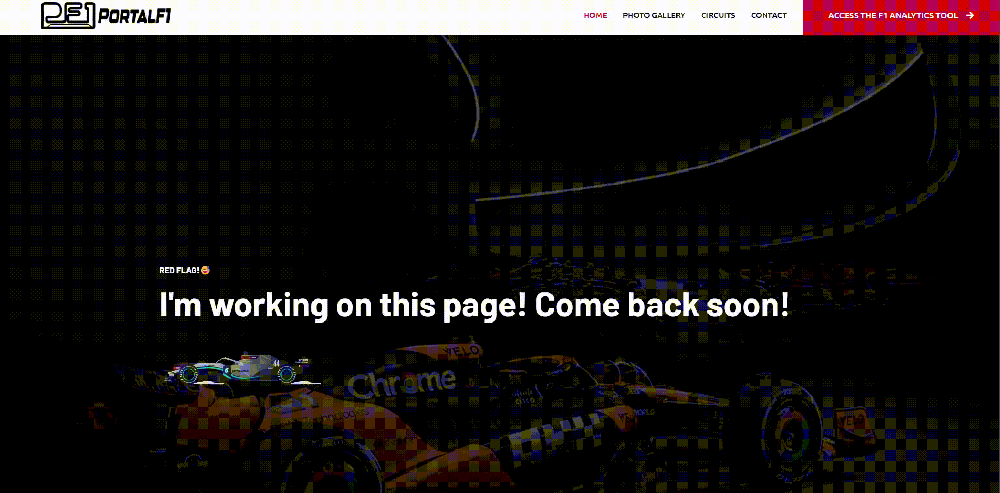

# Portal F1

Esse projeto tem como objetivo o aperfeiçoamento do desenvolvimento de uma aplicação Full Stack partindo dos dados brutos
até a interface do usuário. Os dados utilizados provém de uma base com dados reais da Fórmula 1 do seu início até o ano de 2023.
A base de dados utilizada se encontra no [Kaggle](https://www.kaggle.com/datasets/rohanrao/formula-1-world-championship-1950-2020)
e possui as seguintes informações:

- circuits - Todos os circuitos onde ocorreram um grande prêmio

- constructor_results - Resultados de todos os construtores registrados

- constructor_standings - Pontuação final do campeonato de construtores

- constructors - Todas as equipes que ja foram registradas

- driver_standings - Pontuação final do campeonato de pilotos

- drivers - Todos os pilotos que correram na categoria

- lap_times - Tempos de voltas registrados

- pit_stops - Registro das paradas no pit stop

- qualifying - Registro das sessões de qualificação

- races - Informaçoes de todas as corridas registradas

- results - Resultado geral das corridas

- seasons - Registro de todos os anos que houveram campeonato

- sprint_results - Resultado geral das corridas sprint

- status - Status final da corrida

> Etapas realizadas

### Primeira etapa: Análise de dados e criação do banco
Na análise de dados foi identificado que existem alguns dados nulos e após análise
foi identificado que existem dados nulos porque estão faltando ou porque não existem, como por exemplo, 
os resultados de Q2 e Q3 pois todos os pilotos participam do Q1 mas no Q2 e Q3 a quantidade diminui.
Para tratar os dados nulos foram aplicados duas soluções:

- Dados faltantes: Foram preenchidos com valores brancos(0 pra numerais e espaço para strings)
- Dados inexistentes: Foram criadas tabelas secundárias com chave estrangeira para tabela principal.
  - Exemplo:
    - Arquivo qualifying.csv o registro com qualifyingid igual a 40 só possui valor para o q1.
         - Tabela qualifying 
      
        | qualifyingid | ... | q1  | q2 | q3  |
        |--------------|-----|-----|----|-----|
        | 40           | ... | 1:36.388 | \N  | \N |
        | 14           | ... | 1:26.891| 1:26.413| \N |
        | 9            | ... | 1:26.919 | 1:26.164 | 1:29.593 |
    - Então foram criadas três tabelas nomeadas q1, q2 e q3 possuindo os campos ID, tempo de classificação, e a chave estrangeira que aponta para  tabela qualifying.
         - Tabela q1 
        
        | id | time | qualifying_id |
        |----|------|---------------|
        | 1  | 1:36.388 | 40            |
        | 2  | 1:26.891 | 14            |
        | 3  | 1:26.919 | 9             |

         - Tabela q2
    
        | id | time | qualifying_id |
        |----|------|---------------|
        | 1  | 1:26.413 | 14            |
        | 2  | 1:26.164 | 9             |

         - Tabela q3

        | id | time | qualifying_id |
        |----|------|---------------|
        | 1  | 1:29.593 | 9             |

  


Para todas as tabelas foi configurada uma chave primária única denominada id.


### Segunda etapa: Criação da aplicação com Django

Para criar a aplicação foram utilizados dois templates:

- Template para a sessão de blog: [CARSERV FREE CSS TEMPLATE](https://www.free-css.com/free-css-templates/page291/carserv)
- Template para a sessão de dashboards: [Gradiente Able](https://django-gradient-pro.onrender.com/#)

No desenvolvimento da aplicação foram aplicadas as seguintes etapas:
1. Criação dos models com base na modelagem do banco.
2. Criação dos scripts para salvar os dados no banco.
3. Definição das views de index, drivers e circuits
4. Criação das interfaces.
5. Elaboração das estátisticas.
6. API para os gráficos.
7. Edição da página home.
8. Criação de outras páginas para desenvolvimento futuro
   - Galeria
   - Circuitos
   - Contatos

### Terceira etapa: Definição da home page 

1. Nesta primeira parte página tem um carrossel principal que leva á outras páginas
   - Analytics que é a nossa parte de dashboard e estátisticas
   - Photo Galery onde pretendo preencher com fotos dos carros de várias gerações(ATIVA MAS EM CONSTRUÇÃO)
   - Circuits onde quero trazer informações dos circuitos como traçados, distância e outras infos(ATIVA MAS EM COSNTRUÇÃO)
   
   - 

2. Inseri uma sessão com alguns contadores sobre a história da Fórmula 1 até o périodo atual do meu banco de dados.
    - Total de Corridas
    - Total de Equipes
    - Total de Circuitos
    - Todos os pilotos registrados
    - Quantas equipes foram campeãs de construtores
    - Quanto pilotos se tornaram campeões


3. Editei a parte do footer com minhas informações.

### Quarta etapa: Página Analytics

> Página inicial
1. Defini uma página de ínicio para acessar as estatísticas por um menu lateral e uma parte central com carrossel até então com sessões de pilotos e circuitos.


> Listagem De Pilotos
2. Criei a parte de pilotos que começa com uma listagem com nome, code number, número que o piloto usa, período de carreira, nacionalidade e detalhes que é onde se acessa o dashboard.
A página conta com um filtro por nome e sobrenome do piloto e paginação.


> Dashboard Co Piloto


### Estátisticas 
- Total de corridas e total de corridas completadas
- Poles na carreira
- Total de de chegadas em primeiro, segundo e terceiro lugares

### Gráficos
- ##### Results By Season 
    Acessa o banco atráves de uma api e estrutura um dataset com o resultados importantes agruprados por temporada visualizando toda a carreira do piloto.
    
- #### Points By Season
    Acessa os registros de resultados e soma o total de pontos separando por ano, exibindo toda a carreira
  
    
### Melhores voltas de cada circuito
    
Cada registro se refere ao menor tempo registrado pelo piloto em determinado circuito, trazendo o ano em que marcou essa volta, o tempo e o circuito.


> Listagem de Circuitos

_Adicionei um campo de cadastro de imagem na tabela circuito para adicionar as bandeiras dos países referente aos circuitos, para que pudesse acessar nessa tabela._
 
A listagem recebe todos os circuitos registrados ordenados desta vez por ordem alfabética seguindo o mesmo modelo da listagem de pilotos.


> Dashboard Do Circuito


### Estátísticas
- Total de GPs realizados no circuito
- Quantos pilotos diferentes sairam na pole position
- Quantos pilotos diferentas ganharam esse GP
- Total de voltas registradas em corrida

### Gráficos

- #### Top Winners
    A API consulta dentro da tabela resultados e separando por circuito o todos os pilotos vencedores de cada GP, Somando a contagem de vitórias cada vez que o piloto se repete. O Gráfico exibe do maior para o menor a contagem de todos os pilotos com vitórias do circuito


- #### DNFs By Year
    Esta API acessa os resultados de corridas que não fazem parte de uma lista criada not_dnf_status trazendo assim apenas os registro que contem status de abandono.
    Estes abandonos são agrupados por GP que ocorre geralmente uma vez a cada ano exibe no gráfico todas as vezes que o GP ocorreu.


### Fastest Laps By year
Nesta tabela eu busco o piloto que fez a melhor volta registrada no circuito em cada ano. A volta com o menor tempo de todos recebe um status de record_lap e é pintada de roxo.
     
> Diretório

A estrutura do código segue

```
bash
< PROJECT ROOT >
   |
   |-- portal_f1/                            # Raiz do projeto
   |    |-- applications/                   # Dentro dessa pasta estão as aplicações Analytics e Blog do Django
   |    |-- core/
   |        |-- wsgi.py                     # Starta a aplicação em produção
   |        |-- urls.py                     # Define as urls permitidas
            |-- settings.py                 # Configurações do Projeto
   |    |-- core_access                     # Aplicação de controle de usuarios
   |    |-- core_log                        # Aplicação para salvar o log de alterações do sistema
   |    |-- core_pages                      # Aplicação que contem páginas que são comuns para o projeto
   |    |-- core_registration               # Aplicação que contem os cadastros gerais do sistema
   |    |-- gunicor n                       # Controle para start da aplicação
   |    |-- static                          # Arquivos estaticos
   |    |-- staticfiles                     # Pasta onde o django coloca todos os arquivos estáticos através do comando python manage.py collectstatic
   |    |-- .env                            # Inject Configuration via Environment
   |    |-- manage.py                       # Start the app - Django default start script
   |    |-- README.md                       # Arquivo de descrição
   |    |-- requirements.txt                # Bibliotecas necessárias
   |-- upload_data                          # Scripts que geram os arquivos csv para serem importados no postgreSQL
   |-- ************************************************************************
```
<br />